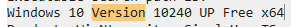
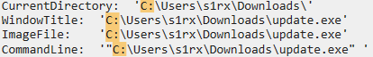
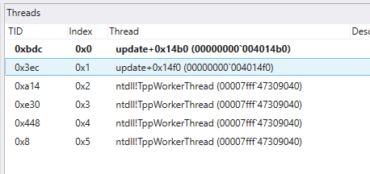

# CrashDump
## Task 1
Open the dmp file using WinDbg and then press ctrl+f to search for "version". The version will be found in path validation summary section.

## Task 2
Run `!peb` on the command line at the bottom of command tab on WinDbg. PEB(Process Enironment Block) stores:
- Full image path
- Command line arguments
- Current directory
- Loaded DLL information

This is often used for malware analysis

## Task 3
Thread count can be viewed on the bottom right of the application otherwise go to view > threads on the top to access thread details

## Task 4
Use `s -a 0 L?80000000 "pipe"` to search for anything that has "pipe" in it. I noticed a text similar format to pipe name format so next step was to search for the text using `s -a 0 L?80000000 "MSSE-1641-s"` which revealed the full pipe name. This works because malwares may hardcode pipe names.

## Task 5
Run `|` to get details on the process including PID.

## Task 6
`.ttime` tells you creation time of the most recent thread.

## Task 7
Start by running `!address` I saw one line where execution was allowed. 

## Task 8
