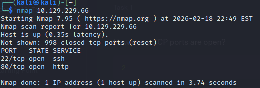
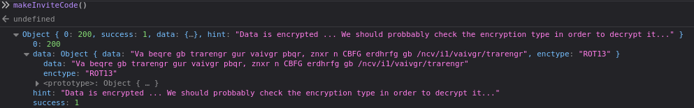
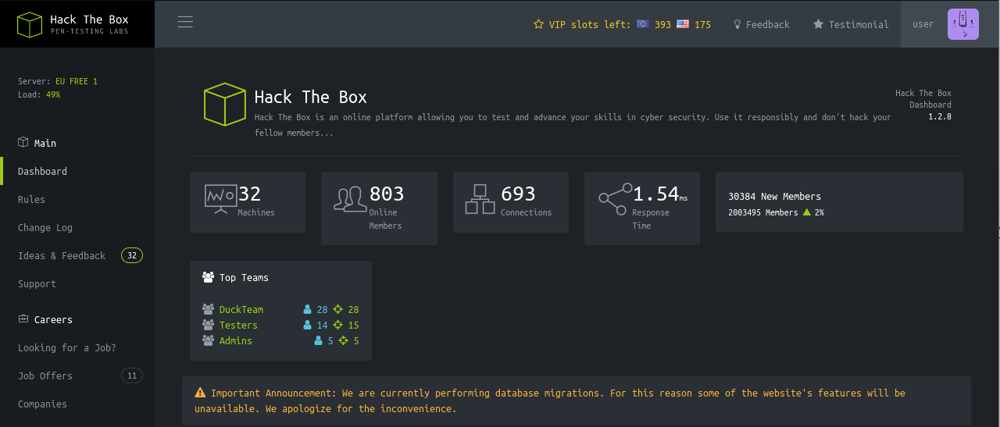
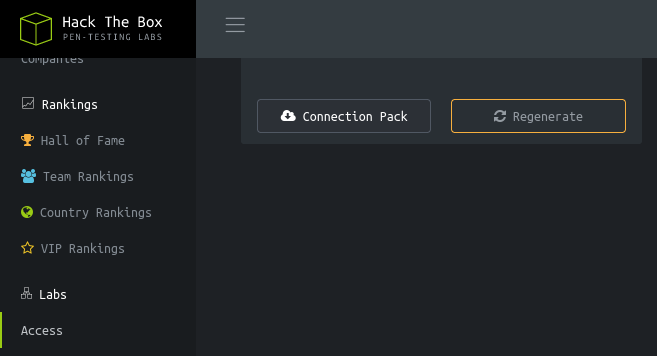
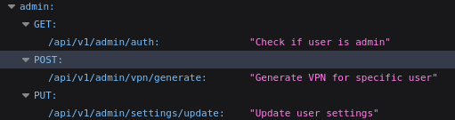
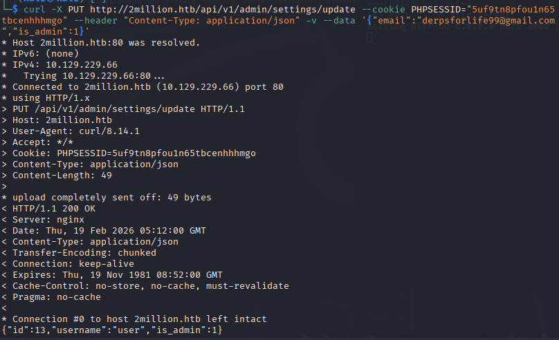
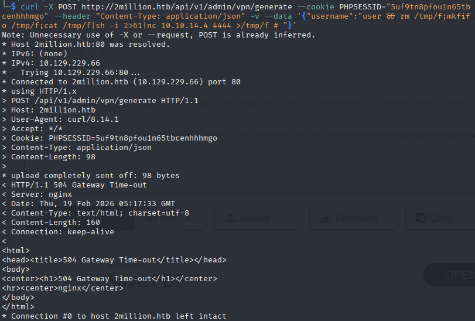
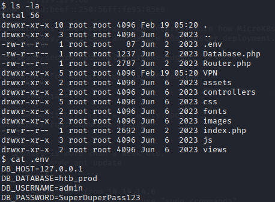
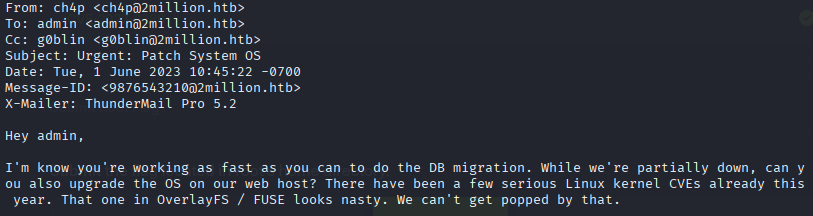

## Nmap Scan

## Initial Foothold
Browse the `/invite` page by click here hyperlink in FAQ section. Upon checking network for files I notice a js file used for invite code. JS file contained a function for making an invite code. Entering that on console gives encrypted data. 

Data decrypts to `In order to generate the invite code, make a POST request to /api/v1/invite/generate` using cyberchef.
Sending POST request to that endpoint gives another code that is base64 encoded. Decoding can be done using cyberchef and the invite code will be received.
After entering the invite code we are prompt to register using email, username and password.

## User Page
After registration and login I was directed to `/home`

After some browsing I found out you can download vpn connection on Access tab using connection pack button. Additionally the download uses the endpoint: `/api/v1/user/vpn/generate`

I did some directory traversal through `/api` then `/api/v1`. As a result I saw 3 endpoints for admin. The `/api/v1/admin/settings/update` endpoint allows us to update user settings meaning we could possibly update created user account to admin.

I was able to get the admin privilege working with this request:

Next I manage to get the injection and setup reverse shell using this command:

Using `pwd` our current directory is at `/var/www/html`
Read into `.env` file in the directory which gave me the admin username and pasword

Username and pasword can be used when connecting to machine IP using command `ssh 10.129.229.66 -l admin` and entering the pasword when prompted to. Opening file on first directory gives user flag.

Next step is to look for mails sent to user to find information on the root. Mails are typically located in `/var/spool/mail/$USER`. I managed to find one mail file.

Finally, I used git clone to download [Github](https://github.com/sxlmnwb/CVE-2023-0386) exploit to local machine and then transfered it to target machine using python servers. Next I compiled all required c files then executed them in mguided order. After script was executed I got root access level and was able to open `/root`. 

How the exploit worked is that uploading lower level file to upper level files had an issue where kernel failed to check for permissions, hence user was able to create an executeable to escalate privillege to a higher level.

